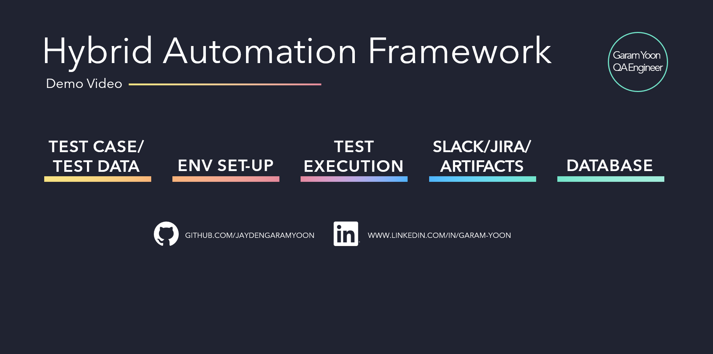
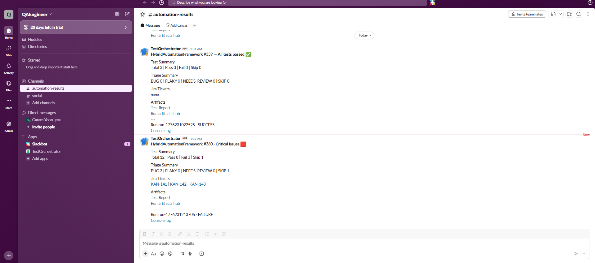
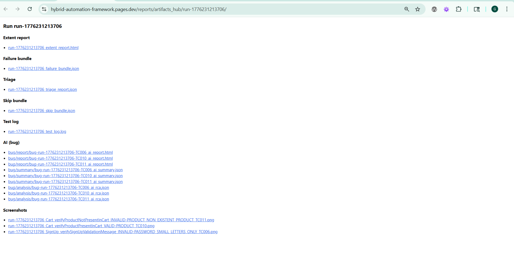
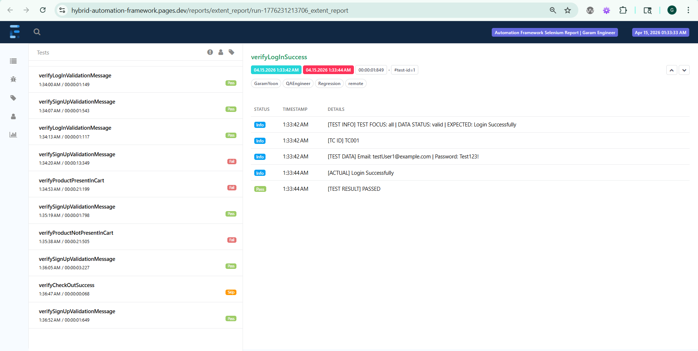
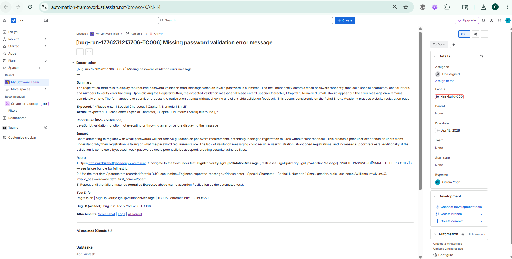
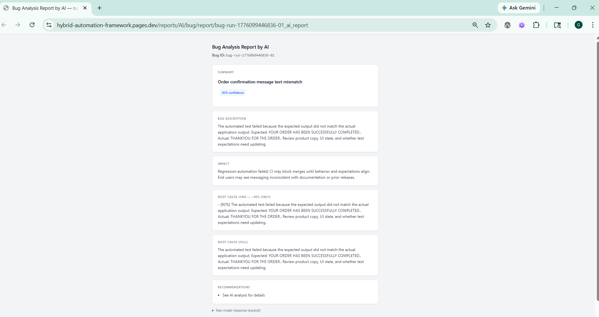
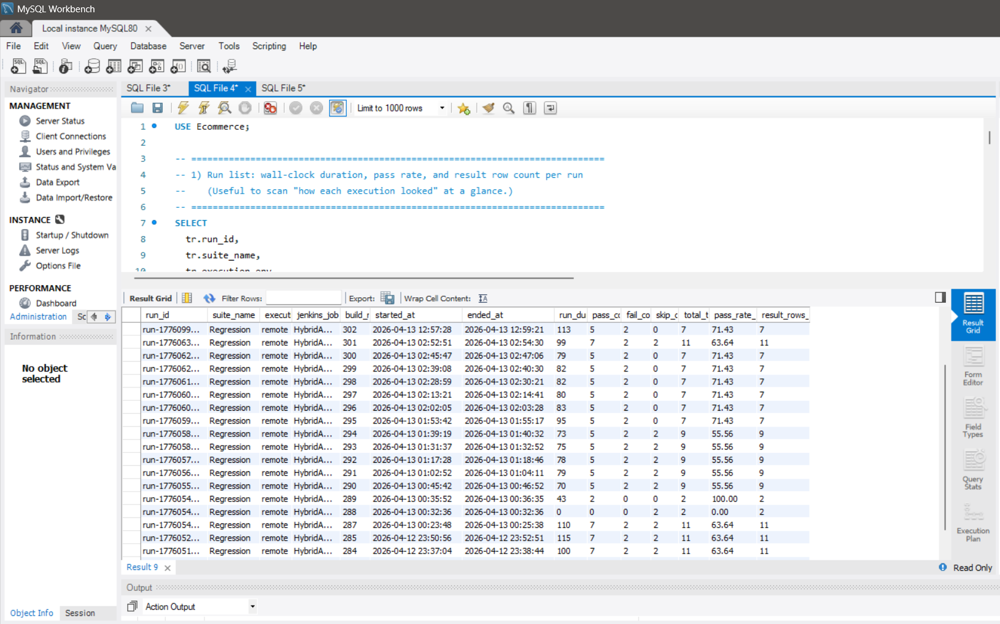

# AI-Assisted Hybrid Automation Framework

[English](README.md)

<p align="center">
  <a href="https://www.youtube.com/watch?v=f14Hr4T5IFw"></a>
</p>

<p align="center">
  <a href="https://www.youtube.com/watch?v=f14Hr4T5IFw"><strong>Demo Video (YouTube)</strong></a>
  ·
  <a href="https://hybrid-automation-framework.pages.dev/reports/artifacts_hub/run-1776231213706/"><strong>Artifacts Hub</strong></a>
  ·
  <a href="https://hybrid-automation-framework.pages.dev/reports/extent_report/run-1776231213706_extent_report"><strong>Extent Report</strong></a>
</p>

<p align="center">
  <em>AI can help reduce manual effort in automation, but how? As a QA Engineer, I believe that to get truly accurate results from AI in our field, we must provide precisely filtered data at the right moment. That’s why I built this AI-Assisted Hybrid Automation Framework</em>
</p>

<p align="center">
  
  
  
  
  
  
  
  
  
</p>

<p align="center">
  
  
  
  
  
  
  
</p>

---

## What is this

- Generate structured evidence files ready for AI analysis
- Examine triage patterns over time, not just single-run snapshots
- Collaborate with an LLM assistant for root cause analysis
- Send real-time notifications to Slack and Jira
- Store test execution details in a dedicated database

| Focus | In practice |
| --- | --- |
| **Traceability & evidence** | Each run has a `run_id`; failures/skips are packaged as **shareable JSON bundles** with **logs** and **screenshots** so debugging does not rely on a single console line. |
| **Triage beyond pass/fail** | Classification uses **historical trends** (e.g. BUG / FLAKY / NEEDS_REVIEW / SKIP), not only green vs red. |
| **CI from source control** | **Jenkins Pipeline from SCM**: the `Jenkinsfile` in the repo drives builds for the checked-out revision. |
| **AI-assisted RCA (optional)** | **LLM-driven root cause analysis** on failure bundles; optional **hosted artifacts** (e.g. HTML reports / static URLs) for stakeholders. |
| **Alerts & issue tracking** | **Slack** for triage and run alerts; **Jira** for **BUG** tracking with aligned context and links. |

## Quick start

```bash
# Prerequisites: JDK 8+, Maven 3+, Python 3 (for MCP optional)

git clone <repository-url>.git
cd hybrid-automation-framework

# Config
cp config.properties.example src/test/resources/config.properties
# Edit Selenium Grid URL, timeouts, optional DB, etc.

# Optional: Selenium Grid
docker compose -f src/test/resources/docker-compose.yaml up -d

# Run tests
mvn clean test -DtestSuite=Regression
```

Full local setup: [`LOCAL_SETUP_GUIDE.md`](LOCAL_SETUP_GUIDE.md). MCP: copy `.env.example` to `.env`, install `mcp/requirements.txt`, run `python mcp/mcp_orchestrator.py` or scripts under `mcp/scripts/`.

## Tech stack

Four layers: UI automation, CI, MCP/LLM, structured evidence. Badges above are the at-a-glance list; the tables spell out what ships in this repo.

| Layer | What runs here | Role |
| --- | --- | --- |
| Automation | Java, Maven, TestNG, Selenium 4, POM, Excel-driven data, TestNG suites, row-level test IDs | UI automation with data-driven suites; user-story TC docs alongside code. |
| CI | Jenkins, Docker Compose (Grid), Git, Python (MCP, scripts) | Pipeline from commit to tests, MCP, notifications; run history and triage JSON for flaky-aware review. |
| LLM | Flask, MCP, Claude or OpenAI-compatible APIs, Slack, Jira | Optional RCA on failure bundles; triage-informed notifications before Jira. |
| Data | Apache POI, Excel, Jackson, ExtentReports, Log4j2, MySQL (optional), REST, Cloudflare Pages (optional) | Structured bundles and logs; optional DB for run history; optional static report hosting. |


## How a run flows

**Run-time**

```
                        Test run
                            │
         ┌──────────────────┼────────────────────┐
         ▼                  ▼                    ▼
     history               FAIL                 SKIP
                            │                    │
                            ▼                    ▼
                     failure bundle          skip bundle
                            │
               ┌────────────◇───────────┐
               │          FLAKY?         │
               │        flips ≥ 3,       │
               │ 20% ≤ fail rate < 100%  │
               └────────────┬────────────┘
                    yes     │    no
                     ▼      └────────► ┌───────────◇──────────┐
                   FLAKY               │          BUG?         │
                     │                 │    fail rate = 100%,  │
                     │                 │        fails ≥ 3      │
                     │                 └───────────┬───────────┘
                     │                     yes     │    no
                     │                      ▼      │     ▼
                     │                     BUG    NEEDS_REVIEW
                     │                      └──────┴─────┘
                     └───────────────────────┘
                                 │
                                 ▼
                   triage report · consolidated bundle

  skip bundle: separate outputs only - not merged into triage report or consolidated failure bundle
```

**Failure triage · SKIP**

| Label | Rule |
| --- | --- |
| **FLAKY** | Status flips ≥ 3, failure rate at least 20% and below 100% (mixed outcomes in the analysis window). |
| **BUG** | Not FLAKY, failure rate = 100%, and fail count ≥ 3 (always failing in that window). |
| **NEEDS_REVIEW** | Anything else for a failed method. |
| **SKIP** | Skipped execution; not classified here (separate skip bundle path). |


**Post-run**

```
 Jenkins pipeline
       │
       ├─► MCP (Flask)
       │
       ├─► analyze-failure (per bundle item)
       │         payload · triage · screenshots → LLM RCA
       │         → reports tree (HTML, RCA JSON, summaries) + handoff JSON
       │
       ├─► Cloudflare Pages - static report URLs (on CF deploy)
       │
       └─► Notifications
                 ├─► Slack - triage summary + label links
                 └─► Jira - BUG tickets (optional), bundle + AI fields
```

## Demo video and live artifacts

- **Video demo (YouTube)**: [YouTube demo video](https://www.youtube.com/watch?v=f14Hr4T5IFw)
- **Artifacts hub (Cloudflare Pages)**: [Artifacts hub (run-1776231213706)](https://hybrid-automation-framework.pages.dev/reports/artifacts_hub/run-1776231213706/)
- **Extent report (Cloudflare Pages)**: [Extent report (run-1776231213706)](https://hybrid-automation-framework.pages.dev/reports/extent_report/run-1776231213706_extent_report)

## Screenshots

Demo assets (no real secrets): [`docs/assets/ci-screenshots/`](docs/assets/ci-screenshots/)

<p align="center">
  <strong>Slack</strong> - QA triage (BUG / FLAKY / NEEDS_REVIEW / SKIP) with links<br><br>
  <br><br>
  <strong>Artifacts hub</strong> - single index page to navigate run outputs<br><br>
  <br><br>
  <strong>Extent report</strong> - detailed run report (steps, logs, screenshots)<br><br>
  <br><br>
  <strong>Jira</strong> - BUG tickets with same context<br><br>
  <br><br>
  <strong>AI analysis</strong> - HTML from MCP<br><br>
  <br><br>
  <strong>Database (optional)</strong> - run summaries in MySQL<br><br>
  
</p>

Slack broadcasts to the team; Jira tracks BUG items. Secrets stay in Jenkins; `jenkins/postNotifications.groovy` builds Jira bodies from the same bundles and AI fields as Slack.

## Setup

See **Tech stack** above for the full picture. **Jenkins (Git-driven CI):** Pipeline job, **Pipeline script from SCM** - repo URL = this Git, branch (e.g. `main`), **Script Path** = `Jenkinsfile`. Each build runs against the **checked-out revision**.

- **`PROJECT_PATH`** is **not** a credential. Set it as a **global or job environment variable** to the repo root (folder containing `pom.xml`), or omit when `WORKSPACE` is already that root.
- **Secrets** (`SLACK_WEBHOOK_URL`, `JIRA_*`, Cloudflare-related vars) live in Jenkins credentials. **`src/test/resources/config.properties` is gitignored** - create from `config.properties.example` or inject on the agent.
- **Build with Parameters** (defined in `Jenkinsfile`): `TEST_SUITE` (choice: `Regression`, `LogIn`, `SignUp`, `Cart`, `CheckOut` — see `testSuites/*.xml`), `SINGLE_TEST_CLASS`, `BROWSER`, `OS`. Empty `SINGLE_TEST_CLASS` runs `testSuites/<TEST_SUITE>.xml`. If `SINGLE_TEST_CLASS` is set, only that test runs and `TEST_SUITE` is ignored. Local: `mvn test -DtestSuite=LogIn` or `-DsingleTest=true -Dtest=...` (`pom.xml` profile).

## Test data (Excel)

`testData/*.xlsx` · Sheet **Sheet1** · loaded by `ExcelDataProvider`.

```
  row columns (email, expected_message, …)
           │
           ▼
    ExcelDataProvider ──► test methods

  tc_id column (TC001, …)
           │
           ▼
  models · failure/skip bundles · triage · Extent · Slack triage line
```

## Manual test cases and traceability

[Test case docs](docs/test-cases/README.md) - one file per `tc_id`, tied to the matching Excel row so spec, data, and runs trace together. Readable before automation exists.

```
  docs/test-cases/TC00n.md          testData/<file>.xlsx · Sheet1
           │                                  │
           └────────── tc_id ─────────────────┘
                         │
           bundles · triage · Extent · Slack
```

- **Identity** — User-story title; table with TC ID, feature, Excel file + Sheet1 row + group; no TestNG/Java columns.
- **Steps** — Numbered; use column names from the sheet; do not paste full tables into markdown.
- **Not here** — Page objects, listeners, framework hooks, or big sheet dumps (keep those in code or CI).

## Framework layout

```
.
├── pom.xml
├── Jenkinsfile
├── config.properties.example          # → src/test/resources/config.properties (gitignored)
├── testSuites/                        # Regression.xml + one-class suites (LogIn, SignUp, Cart, CheckOut)
├── testData/                          # Excel (Sheet1 + optional tc_id)
├── src/test/java/
│   ├── testCases/
│   ├── pageObjects/
│   ├── testBase/
│   ├── triage/                        # bundles, classification, history
│   └── utils/                         # ExcelDataProvider, listeners, db (RunSummaryDb), config, run context
├── src/test/resources/
│   ├── log4j2.xml
│   └── docker-compose.yaml            # Selenium Grid (optional local)
├── mcp/
│   ├── mcp_orchestrator.py
│   ├── requirements.txt
│   └── scripts/                       # start_mcp.ps1, start_mcp.bat
├── jenkins/
│   ├── postNotifications.groovy
│   └── run_mcp_server_jenkins.groovy
├── scripts/                           # RCA helpers, deploy_cf_pages.bat, …
├── tools/                             # e.g. test_mcp.py (dev / smoke)
├── docs/
│   ├── README.md
│   ├── test-cases/
│   └── assets/ci-screenshots/
├── reports/                           # extent, failure, skip, triage, AI, history, …
├── logs/
├── screenshots/
└── target/                            # Maven / Surefire output
```

Generated or local-only paths (`logs/`, `reports/`, `screenshots/`, `target/`, `.venv/`, …) are listed in `.gitignore` where applicable.

## License

[MIT License](LICENSE)

---

<p align="center">
  <strong>Garam Yoon</strong> · QA automation / test tooling
</p>
